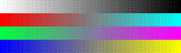



## Color ordered\-dither \(Halftone\-216/Optimal\)

### Description

8-bpp color ordered-dither: Halftone-216 + ordered dither lets reduce to 8-bpp bitmaps with acceptable quality/speed. You can also test color reduction using optimal palette and compare results. (Note: Optimal palette extraction has been speed-optimized). 

----

Last update: 03.05.22
 
### More Info
 

             |
---                |---
**Submitted On**   |2003-05-23 02:35:50
**By**             |[Carles P\.V\.](https://github.com/Planet-Source-Code/PSCIndex/blob/master/ByAuthor/carles-p-v.md)
**Level**          |Intermediate
**User Rating**    |5.0 (50 globes from 10 users)
**Compatibility**  |VB 6\.0
**Category**       |[Graphics](https://github.com/Planet-Source-Code/PSCIndex/blob/master/ByCategory/graphics__1-46.md)
**World**          |[Visual Basic](https://github.com/Planet-Source-Code/PSCIndex/blob/master/ByWorld/visual-basic.md)
**Archive File**   |[Color\_orde1763066282004\.zip](https://github.com/Planet-Source-Code/carles-p-v-color-ordered-dither-halftone-216-optimal__1-45435/archive/master.zip)

